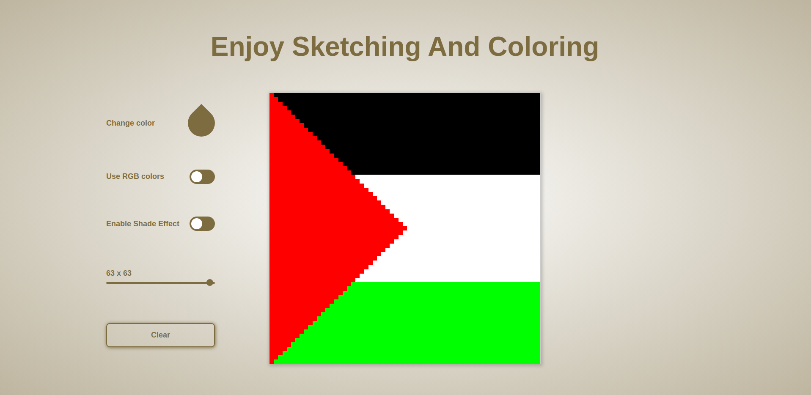

# Etch-a-Sketch

Go creative and transform your ideas into attractive designs. [Live Demo](https://abed-37h.github.io/etch-a-sketch/)

## Preview

Here is a preview of what you can do. Of course, it's not limited to it, so unleash your creativity.

## Features of this simple app

- Obviously, it lets you draw and color.
- You can change pen color.
- You can also use randomized RGB colors.
- It allows you to use extra shade if you want.
- It gives you the ability to change number of pixels used in the grid. This may increase or decrease the accuracy of your drawing.
- And Finally, clear your work.

## Additional features for future

- Save work
- Undo changes

*Feel free to recommend me some ideas.*

## Key skills deployed and developed in this project

- HTML
- CSS with Flexbox
- JavaScript using DOM manipulation
- A small touch of web design